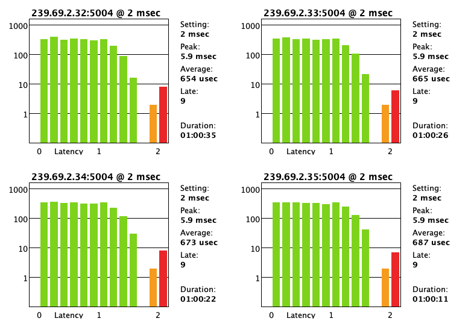

# AES67 Sender Enhanced
This program expands on the original work by https://github.com/philhartung to make soundcard input available on an AES67 network using Node.js.

The enhanced edition adds support for channel mapping as well as the automatic creation of multiple AES67 flows when needed.
This software also properly converts 32-bit floating point audio from the soundcard into actual 24-bit audio as specified in AES67, making it suitable for professional audio applications, rather than padding 16-bit audio with zeroes as in the original.

## Installation
To install aes67-sender-enhanced, clone the repository and install the dependencies.
```
git clone https://github.com/teletype1/aes67-sender-enhanced.git
cd aes67-sender-enhanced
npm install
```
Audify (audio backend used) prebuilds are available for most major platforms and Node versions. If you need to build Audify from source, see https://github.com/almogh52/audify#requirements-for-source-build.

## Usage
To display the help, execute `node aes67-sender-enhanced --help`:
```
Usage: aes67-sender-enhanced [options]

Options:
  -V, --version            output the version number
  -v, --verbose            enable verbosity
  --devices                List audio devices
  -d, --device <index>     Which audio device to use.  Use --devices to see a list and corresponding device index numbers.
  -m, --mcast <address>    First address to multicast the AES67 stream.  
                           Leave space for more addresses if you plan to stream more than 8 channels.
  -n, --streamname <name>  Name of AES67 stream(s).  "-Bank-" will automatically be added with a bank number, 
                           corresponding to groups of up to 8 channels.
  -c, --channels <number>  Number of channels.  Must match the patch list (below) or be less than the total channel available from the device.
  -p, --patch <list>       Channel Map from the input device, in the order you would like them, separated by commas. (i.e., 1,2,3,5,7,8,12,etc).
                           Channels do not need to be in the order they come from the soundcard, and can be repeated.
  -a, --api <api>          Audio API/Driver to use (ALSA, OSS, PULSE, JACK, MACOS, ASIO, DS, WASAPI)
  --address <address>      IPv4 address of network interface
  -h, --help               display help for command
```

The software has to be executed with priviliges, because the PTP client binds to ports below 1024.

## Test Environment
This software was tested with a Midas M32R connected via USB to a 2011 iMac running High Sierra.  Using this equipment I was successfully able to put 32 channels of audio onto the network and recieve them using Ravenna Virtual Soundcard on MacOS Ventura, and record to Pro Tools.  I was also able to use Dante Controller to send the channels to another console (a SoundCraft Si Impact with a Dante Card).  The audio arrived at the Midas M32 via an AES50 connection from a Behringer 32x16 stage box, so it was already digital when received at the console.  

### Latency considerations (from philhartung's original version)
In practice low latency is important. Especially when working in a hybrid Dante/AES67 network, latency should be under 2ms. Dante devices are fixed to a maximum of 2ms latency and drop packets with higher latency. With a Raspberry Pi, latency jitter is quite high. A lot/too many packets are dropped because latency is too high when sending audio to a Dante receiver. 

Update 9/21/24:  I've been using a few single board Linux machines for testing recently.  Initially I tried a NanoPi NEO 3, since it would be very convenient to have a $40 headless computer with USB3 and gigabit ethernet putting channels on the network.  This worked fine, but once I got past 8 channels, the NanoPi just couldn't keep up.  The CPU usage wasn't pegging, but it seems a system of that type just can't crunch the numbers quite fast enough, despite it being quad-core.  I switched to using a Raspberry Pi 5 and the performance is nearly perfect.  Average latency is 1.3ms from the RPi 5 through 3 gigibit switches to a SoundCraft console with a Dante card.

### Notes from me
In my experience there was very little (if any) packet loss from the iMac, even with its age.  I will continue to test the software on newer machines and perhaps an RPi (if I can get one!). The network used for testing is installed at The Loft Live, a music venue in Columbus, GA, using their consoles and computers for development.  The network uses one managed switch and two satellite gigabit unmanaged switches with WiFi APs next to the consoles.  All of the networking equipment is off-the-shelf, made by Netgear.  Phil's original version has a method that resyncs the internal clock to the PTP master, and in my testing the clock never drifted more than 1.2ms, with resyncing occuring every 1 second.  

In reality this software is probably not suitable for "live" applications - like feeding a monitor console.  However, it may be useful for broadcast applications (especially where a delay is inherint in the video system), and it is definitely useful for recording of live performances with higher channel counts.  Since I also teach live mixing at Columbus State University, it will be useful for taking the raw channels from the stage box in one room, and putting them on a second console in another room, so students can mix real audio for practice and learn without an audience, but with actual sound happening live in another room.  This is much more fashionable than practicing mixing with recorded tracks :)

Under Armbian and Raspberry Pi OS, I've found complications with RtAudio not supporting the format of the Midas console.  However, Pulse Audio seems fine.  To avoid the trickiness of setting up Pulse to work as root, it's probably preferable to use the following command to allow Node.js to bind to ports under 1024:

```sudo setcap 'cap_net_bind_service=+ep' `which node` ```

This will all you to use aes67-sender-enhanced without sudo.

Here is a screenshot of Dante Controller-reported latency when transmitting 32 channels for about an hour from the Midas/iMac to the Soundcraft.


